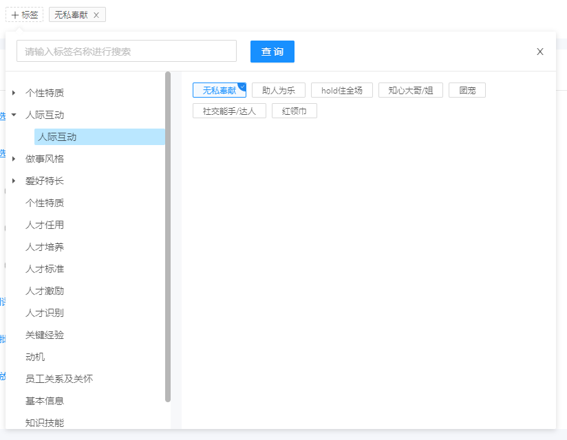
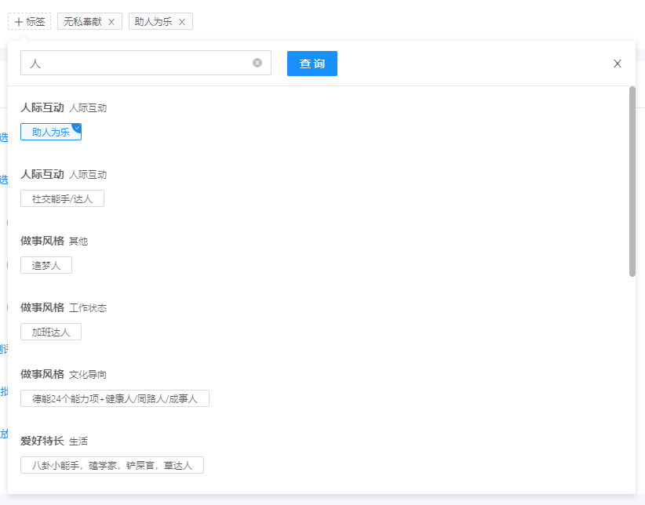

### 效果

原始：

搜索：


### 交互效果：

左侧为树级结构，目的是为了支持多层级。叶子节点才是真实标签，叶子节点以上节点都只能点击或者展开；同时支持搜索。

### 分析：

1. 数据结构： 左侧树级结构数据处理，接口返回的是一个常见的树，如何处理成需要数据格式是一个重点；
2. 搜索： 此交互为通用搜索模块，原始为一层，搜索结果为一层。
3. 实时交互： 大多情况下标签为实时交互，即点击就保存。现有的交互是点击标签则添加，如已添加则删除。

#### 数据结构

分为两部分，左侧树结构数据，右侧为左侧树结构叶子节点数据，先来看下项目处理代码

```Javascript
handleTagTreeData (data, limitLevel = 2) {
    const newTreeData = cloneDeep(data)

    PanguTreeTool.forEach(newTreeData, node => {
        if (node.parentNodeFlag && !node.children[0].parentNodeFlag) {
            node.isLeaf = true
            const children = node.children
            node._children = children
            node.children = []
        }
    })

    return newTreeData
}

// PanguTreeTool 是我写的一个树处理的工具库，来看下 PanguTreeTool.forEach 的实现

forEach (tree, func, config = {}) {
    config = getConfig(config)
    const list = [...tree], { children } = config
    for (let i = 0; i < list.length; i++) {
        func(list[i])
        list[i][children] && list.splice(i + 1, 0, ...list[i][children])
    }
}
```

isLeaf 是因为 ant-design-vue 树组件如果识别到这个属性，就认为该节点是叶子节点界面表示为不会再出现折叠箭头了；parentNodeFlag 是后端返回的属性，来判断当前节点是否父节点（实际上也是根据节点的 children 个数来判断），举个例子：假如有层级 A-B-C 那么遍历到 B 节点的时候，B 的 parentNodeFlag 肯定是 true，然后取第一个 children 的 parentNodeFlag 也就是 C 的 parentNodeFlag，这时候肯定是 false，那么 if 判断命中，把 B 节点添加 isLeaf 属性同时设置为 true，接着 children 置空并且设置私有属性 \_children 给予右侧展示。

#### 搜索

搜索是个比较头疼的问题，搜索池是叶子节点的数据，命中匹配的话需要带上其父级路径。期望是根据一个 for 循环就能把数据排除出来，然后按照排除出来的数据显示即可。

根据这个期望，就有一个思路：拿到所有叶子节点数据，并且每个叶子节点都带上父级到根级的路径。来看下实现代码：

```Javascript
handleTagSearchTreeData (data) {
    const newTreeData = cloneDeep(data)

    const nodeList = PanguTreeTool.findPathAll(newTreeData, node => !node.parentNodeFlag)

    let _titleValueList = new Map()

    for (let i = 0; i < nodeList.length; i++) {
        const item = nodeList[i]

        if (item.length === 1) {
            _titleValueList = this.uniqueData(_titleValueList, item, item)
            continue
        }

        const lastItem = item.pop()
        _titleValueList = this.uniqueData(_titleValueList, item, lastItem)
    }

    return _titleValueList
},
uniqueData (data, key, value) {
    if (data.has(key)) {
        const keyMap = data.get(key)
        Array.isArray(keyMap) ? keyMap.concat(value) : keyMap.push(value)
        data.set(key, keyMap)
    } else {
        data.set(key, Array.isArray(value) ? value : [value])
    }

    return data
},

// PanguTreeTool.findPathAll 实现方法
findPathAll (tree, func, config = {}) {
    config = getConfig(config)
    const path = [], list = [...tree], result = []
    const visitedSet = new Set(), { children } = config
    while (list.length) {
        const node = list[0]
        if (visitedSet.has(node)) {
            path.pop()
            list.shift()
        } else {
            visitedSet.add(node)
            node[children] && list.unshift(...node[children])
            path.push(node)
            func(node) && result.push([...path])
        }
    }
    return result
},
```

于是数据就处理完了，搜索的时候

```Javascript

// tagSearchSourceData 为前面处理过的搜索数据
handleSearch () {
    const searchword = this.searchData.searchKeyword
    if (typeof searchword !== 'string') {
        this.searchData.show = false
        return
    }
    const keyword = `${searchword}`.trim()
    this.searchData.data = this.handleSearchData(keyword)
    this.searchData.show = !(keyword === '')
},
handleSearchData (keyword) {
    const searchData = cloneDeep(this.tagSearchSourceData)
    const dataResult = []

    for (const item of searchData.keys()) {
        const data = {
            _parent: item
        }

        const cloneItem = cloneDeep(item)

        const TITLE = cloneItem.length && cloneItem.shift()
        const _title = TITLE.title
        const _subtitle = cloneItem.map(i => i.title).join('-')

        const itemValue = searchData.get(item)
        const result = itemValue.filter(i => i.title.toLowerCase().includes((keyword || '').toLowerCase()))

        if (result.length) {
            data._children = result
            data._title = _title
            data._subtitle = _subtitle
            dataResult.push(data)
        }
    }

    return dataResult
},
```

#### 实时交互

原始选中的数据传进来，新增/删除之后 emit 出去，这里有个细节：点击时候现在界面实时显示新增或删除，然后再发起接口请求。

```
handleTagUpdate (tagList) {
    const data = {
        applicantId: this.applicantInfo.applicantId,
        tagIdList: tagList.map(i => i.tagId)
    }
    this.selectedTag = tagList
    ApplicantServices.setApplicantTag(data)
}
```

### 应用

```JavaScript
<template>
    <ApplicantTag
        class="information-applicant-tag"
        :editable="editable && $_has('Service$applicantTagService$create')"
        :selectedTag="selectedTag"
        @update="handleTagUpdate"
    />
</template>

<script>
export default {
    data () {
        return {
            selectedTag: this.applicantInfo.tagList
        }
    },
    methods: {
        handleTagUpdate (tagList) {
            const data = {
                applicantId: this.applicantInfo.applicantId,
                tagIdList: tagList.map(i => i.tagId)
            }
            this.selectedTag = tagList
            ApplicantServices.setApplicantTag(data)
        }
    }
}
</script>

```
